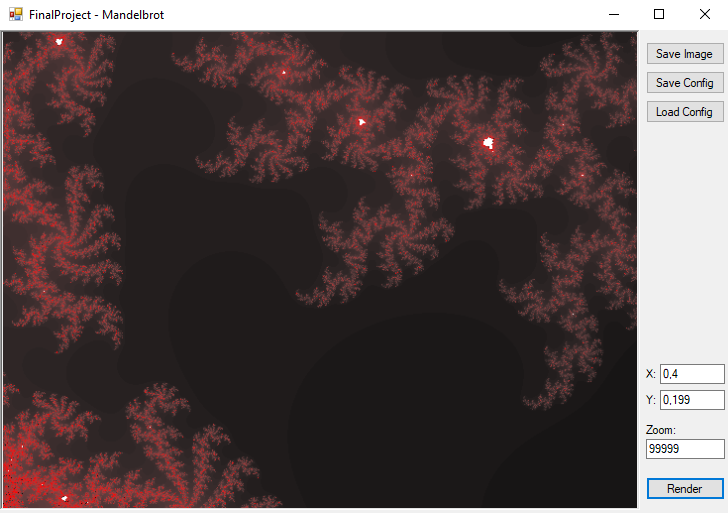

# CS-MandelbrotViewer
A C# Mandelbrot viewer quickly made for a university subject in 2020.

- Uses WinForms
- Renders the image on a second thread to prevent freezing
- Can save an image as a .bmp file
- Can save/load the current configuration

### Preview image:

